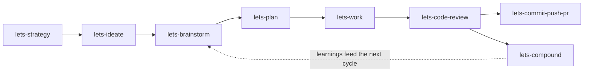

# lets-engineer

> A [Claude Code](https://claude.com/claude-code) plugin of opinionated, compounding engineering workflows — **brainstorm → plan → build → review → ship** — where each stage leaves durable artifacts that make the next one sharper.

[](LICENSE)


`lets-engineer` is a toolkit of **26 workflow skills** (backed by **46 specialized review and research agents**) that turn a coding agent into a disciplined engineering partner. Instead of one-shot prompts, each skill runs a real workflow: it asks the right questions, produces a durable artifact — a requirements doc, a plan, a learning — and hands off cleanly to the next stage. Knowledge accrues in your repo, so the work *compounds*.

Adapted from [Every's Compound Engineering plugin](https://github.com/EveryInc/compound-engineering-plugin).

## The pipeline



Each arrow is a handoff. `lets-brainstorm` writes a requirements doc that `lets-plan` consumes; `lets-plan` writes a plan that `lets-work` executes; `lets-code-review` and `lets-compound` feed learnings back so the next cycle starts smarter. Every skill also works standalone — start wherever the work is.

> This plugin eats its own dog food: the `lets-explain` skill was built end-to-end through the pipeline above — see [`docs/brainstorms/`](docs/brainstorms) and [`docs/plans/`](docs/plans) for its requirements doc and plan.

## Install

Requires [Claude Code](https://claude.com/claude-code). In a Claude Code session:

```
/plugin marketplace add williamzelesny/lets-engineer
/plugin install lets-engineer@lets-engineer
```

Then check your environment and optional CLI dependencies:

```
/lets-setup
```

Skills run as slash commands (e.g. `/lets-brainstorm`, `/lets-plan`, `/lets-work`) and also activate automatically when your request matches what a skill is for.

## Quick start

```
/lets-brainstorm a feature you're considering   # → docs/brainstorms/<topic>-requirements.md
/lets-plan                                       # → docs/plans/<dated>-plan.md
/lets-work                                       # implements, tests, reviews, and ships it
```

Each step reads the previous step's artifact, so you confirm scope once and let the chain carry it forward.

## Skills

**Strategy & ideation**

| Skill | What it does |
|---|---|
| `lets-strategy` | Create/maintain `STRATEGY.md`: target problem, approach, users, metrics, tracks of work |
| `lets-ideate` | Generate and pressure-test grounded ideas before committing to one |
| `lets-product-pulse` | Time-windowed pulse report on usage, quality, errors, and signals worth investigating |

**Define — brainstorm & plan**

| Skill | What it does |
|---|---|
| `lets-brainstorm` | Collaborative requirements dialogue → a right-sized requirements doc |
| `lets-plan` | Turn requirements into a structured, reviewable implementation plan (with optional deepening pass) |
| `lets-doc-review` | Multi-persona review of requirements or plan documents |

**Build**

| Skill | What it does |
|---|---|
| `lets-work` | Execute a plan (or a bare prompt) to a finished, tested, reviewed feature |
| `lets-worktree` | Spin up an isolated git worktree for parallel work or PR review |
| `lets-debug` | Systematically find root causes from errors, test failures, or issue references |
| `lets-optimize` | Metric-driven iterative optimization loops with parallel experiments |

**Frontend & design**

| Skill | What it does |
|---|---|
| `lets-frontend-design` | Build web interfaces with genuine design quality, verified by screenshots |
| `lets-gemini-imagegen` | Generate and edit images via the Gemini API (Nano Banana Pro) |
| `lets-polish-beta` | _[beta]_ Launch the dev server and iterate on a feature live in the browser |

**Review & ship**

| Skill | What it does |
|---|---|
| `lets-code-review` | Tiered persona code review with confidence-gated, deduplicated findings |
| `lets-explain` | Orientation-first, teaching-depth walkthrough of a change — explains, doesn't critique |
| `lets-resolve-pr-feedback` | Evaluate and fix PR review threads in parallel, then reply and resolve |
| `lets-commit` | Create a clear, value-communicating commit |
| `lets-commit-push-pr` | Commit, push, and open a PR with an adaptive, value-first description |
| `lets-demo-reel` | Capture GIFs, terminal recordings, or screenshots as PR evidence |

**Compound — knowledge that accrues**

| Skill | What it does |
|---|---|
| `lets-compound` | Document a solved problem so your team's knowledge compounds |
| `lets-compound-refresh` | Refresh and consolidate stale learnings under `docs/solutions/` |
| `lets-sessions` | Search and query past coding-agent session history (Claude Code, Codex, Cursor) |

**Stack styles & meta**

| Skill | What it does |
|---|---|
| `lets-dhh-rails-style` | Write Ruby/Rails in DHH's 37signals style |
| `lets-agent-native-architecture` | Build applications where agents are first-class citizens |
| `lets-setup` | Diagnose and configure your lets-engineer environment and CLI dependencies |
| `lets-update` | Check whether the plugin is up to date and recommend the update command |

## How it compounds

Skills write durable artifacts into your repo, and later runs read them back:

- `docs/brainstorms/` — requirements docs from `lets-brainstorm`
- `docs/plans/` — implementation plans from `lets-plan`
- `docs/solutions/` — learnings from `lets-compound`, kept current by `lets-compound-refresh`
- `STRATEGY.md` — product direction from `lets-strategy`

The more you use the pipeline, the more context the agent has about your codebase and decisions — so each cycle starts further ahead than the last.

## Harness support

Built for **Claude Code** — install, the plugin cache, and slash commands assume it. The skill instructions are written harness-aware (they reference equivalents on Codex, Gemini, and Pi), but Claude Code is the supported, tested path.

## Credits & license

Adapted from [Every's Compound Engineering plugin](https://github.com/EveryInc/compound-engineering-plugin) by Kieran Klaassen and Dan Shipper, used under the MIT License.

Licensed under the [MIT License](LICENSE).
