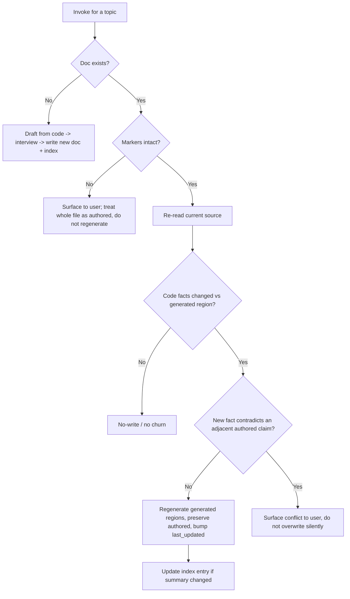

# feat: Add lets-document skill for application documentation

## Summary

Add a new `lets-document` skill to the lets-engineer plugin that documents how an application works — architecture, functionality, and business processes — as durable in-repo markdown. Implementation is a `SKILL.md` spine plus four `references/` files, mirroring the `lets-strategy` "route by file state" + interview/template split, with code-derived content drafted from source and human "why" captured via a targeted interview. The hard part is the refresh lifecycle: per-doc provenance markers let a re-run regenerate the code-derived regions while preserving the human-authored regions verbatim.

---

## Problem Frame

The suite can explain a *change* (`lets-explain`) and capture a *solved problem* (`lets-compound`), but nothing documents the system *as it currently stands* so a contributor can learn how it functions. See origin for the full problem framing (Sources & References).

---

## Requirements

Requirements trace to origin `docs/brainstorms/2026-06-09-documentation-skill-requirements.md`.

**Invocation and scope**
- R1. Optional topic argument; a named topic produces one focused doc.
- R2. No topic produces a broader whole-application survey.
- R3. Covers three content kinds: architecture, functionality, business processes.

**Content sourcing**
- R4. Reads the codebase to draft code-legible content before involving the user.
- R5. Targeted interview captures content code can't reveal (rationale, process context, constraints), woven into the doc.
- R6. Interview is targeted and one-question-at-a-time — asks only about gaps the code couldn't fill.
- R7. Every codebase claim in a generated doc is grounded in actual source, not guessed.

**Output and structure**
- R8. Markdown, one doc per topic, in an in-repo docs home.
- R9. A maintained index/overview doc links the per-topic docs into a navigable map.
- R10. Mermaid diagrams where they aid understanding of structure or flow; prose-only otherwise.
- R11. Teaching/onboarding depth, not terse reference.

**Refresh lifecycle**
- R12. Re-running for an existing topic refreshes that doc in place, no duplicate.
- R13. Refresh updates code-derived sections from current code while preserving human-authored content.
- R14. When a refresh detects code that contradicts a human-authored section, it surfaces the conflict instead of overwriting silently.

**Packaging and positioning**
- R15. Ships as a new skill following existing SKILL.md conventions.
- R16. Description positions it distinctly from `lets-explain` (changes) and `lets-compound` (solved problems).

**Origin actors:** A1 (Documenter — invokes, answers interview), A2 (Contributor/reader — reads docs + index), A3 (Skill agent — reads code, drafts, interviews, writes, refreshes)
**Origin flows:** F1 (Document a topic or survey), F2 (Refresh an existing doc)
**Origin acceptance examples:** AE1 (covers R1, R2), AE2 (covers R12, R13), AE3 (covers R5, R6), AE4 (covers R14)

---

## Scope Boundaries

- No drift-aware or auto-staleness tracking and no manifest — refresh is user-initiated (that behavior overlaps `lets-compound-refresh`).
- No publishing to an external doc site, wiki, or hosted portal; in-repo markdown only.
- No API-reference generation from code annotations or docstrings.
- Not documenting changes/diffs (`lets-explain`) or solved problems (`lets-compound`).
- No README or changelog authoring (for the *target* app); not auto-invoked on commit or in CI.

### Deferred to Follow-Up Work

- Seed `docs/solutions/` by running `/lets-compound` on the provenance-marker design after this lands: separate follow-up — the solutions store does not exist yet and this is the kind of durable learning that would seed it.

---

## Context & Research

### Relevant Code and Patterns

- `plugins/lets-engineer/skills/lets-strategy/SKILL.md` — **primary structural template.** "Phase 0: Route by File State" (file absent → first run; file exists → targeted update, preserve other sections), rerunnable update-in-place, and the `references/interview.md` + `references/*-template.md` split. Lighter than `lets-compound-refresh`, and the right fit for user-initiated single-mode refresh.
- `plugins/lets-engineer/skills/lets-product-pulse/SKILL.md` + `references/interview.md` — interview discipline: one question at a time via `AskUserQuestion`, push back once on a weak answer then capture and move on, honor upstream answers (don't re-ask). Block-list `allowed-tools` including `AskUserQuestion`.
- `plugins/lets-engineer/skills/lets-explain/SKILL.md` — code-reading skill with teaching-depth output, positioning callout + "Not for:" sibling boundaries, opt-in durable write to a `docs/<area>/` home created on demand.
- `plugins/lets-engineer/skills/lets-compound/SKILL.md` — refresh-in-place decision table (update existing vs create new), conflict-surfacing, and frontmatter/template-asset conventions.
- `docs/plans/2026-05-29-001-feat-lets-explain-skill-plan.md` — the playbook for adding a skill to this plugin; source of the `(verified)` inline convention that satisfies R7.

### Institutional Learnings

- No `docs/solutions/` store exists yet — institutional knowledge lives in the sibling skills above and the user's auto-memory.
- **Version-bump convention** (auto-memory + origin Dependencies): adding a skill is a content merge to main and requires bumping `version` in both `plugins/lets-engineer/.claude-plugin/plugin.json` and `.claude-plugin/marketplace.json` (both currently `0.2.0`); a new skill is a minor bump → `0.3.0`. The `/lets-update` check reads only `plugin.json`'s version (verified) — so the `plugin.json` bump is what prevents `/lets-update` from silently reporting "up to date"; the `marketplace.json` bump is the separate keep-both-in-sync convention.
- **Skills are auto-discovered** (verified against the `lets-explain` commit `bfb7514`): creating the skill directory + `SKILL.md` registers it; neither manifest contains a skills array. There is no per-skill version field.
- **No automated test harness** (verified — no `package.json`/test tooling): skills are verified by dogfooding, not a suite.

### External References

- None gathered — local sibling-skill patterns are strong and directly applicable, so external research was skipped.

---

## Key Technical Decisions

- **Docs home `docs/how-it-works/` with an `index.md`**: chosen over the brainstorm's floated `docs/architecture/` because the docs also cover functionality and business processes, not only architecture; a single per-skill `docs/<area>/` home mirrors every sibling skill. User-overridable before adoption.
- **Skill name `lets-document`**: working name adopted as final.
- **Provenance via per-section HTML-comment markers**: each section is individually wrapped in a paired `generated`/`authored` HTML-comment marker (invisible in rendered markdown), so generated and authored sections can **alternate** through the doc (architecture → why → flow → business process), not just sit in two doc-spanning blocks. Refresh locates and regenerates each `generated` region independently from current source and preserves each `authored` region verbatim. Chosen over (a) whole-file regeneration (destroys human content) and (b) fixed section-identity provenance (couldn't interleave generated and authored content). This is the load-bearing new design — no existing skill preserves intra-file regions (verified: `lets-compound-refresh` preserves whole files, not regions).
- **Refresh integrity contract** (the part with no precedent, specified so an implementer can build it without inventing it):
  - *Marker integrity first* — if an existing doc's markers are missing or malformed (hand-stripped, mangled by a merge or a comment-stripping formatter), refresh does **not** regenerate in place; it treats the whole file as authored and surfaces it to the user rather than risk clobbering hand edits.
  - *Drift is a code-fact change, not prose wording* — because regeneration is non-deterministic, "drifted" means the set of structural facts (components, flows, boundaries, source paths) changed, not that the prose reworded. No fact change → no-write (this is what makes the no-churn discipline real rather than nominal).
  - *Conflict detection is explicit* — after regenerating a `generated` region, the agent checks whether any new code fact contradicts a claim in an adjacent `authored` region, names the specific authored sentence and the contradicting fact, and surfaces it via the blocking question tool instead of overwriting (R14).
  - *Human-edit safeguard* — a visible one-line boundary cue tells editors to put prose in authored regions; if refresh finds prose inside a `generated` region that the code draft wouldn't produce, it surfaces it rather than discarding it.
- **Route-by-File-State over a multi-outcome refresh machine**: model the refresh routing on `lets-strategy`, not `lets-compound-refresh`'s heavier interactive/headless five-outcome flow — the scope is user-initiated and single-mode; borrow only its conflict-surfacing and no-churn discipline.
- **Reference-file split** (`codebase-research`, `interview`, `output-format`, `refresh`) loaded on demand at the phase that needs them, per the plugin's "read at the step that needs it — do not bulk-load" convention.
- **Verification by dogfooding**: the plugin has no automated test harness, so each feature-bearing unit's "test scenarios" are concrete invocation runs with observable expected outcomes, mapped to the origin acceptance examples.
- **`allowed-tools` as a block list** including `AskUserQuestion`; no manifest skills-array edit (auto-discovery).

---

## Open Questions

### Resolved During Planning

- Docs home location: `docs/how-it-works/` (was deferred-to-planning in origin).
- Code-derived vs human-authored separation mechanism: HTML-comment region markers (was deferred-to-planning in origin).
- Final skill name: `lets-document` (was deferred-to-planning in origin).

### Deferred to Implementation

- Exact marker token wording (e.g. `<!-- lets-document:generated -->` vs an alternative) and the visible boundary-cue text — settle while authoring the template so the markers read cleanly in a real doc.
- Exact index entry format (per-topic line shape, grouping when topics accumulate).
- Whether survey mode (no topic) writes only the overview + index or also seeds per-subsystem topic stubs — decide when dogfooding the survey path on a real repo. Default to overview + index only (origin R2 says "a broader survey", not stub-seeding).
- Conflict *resolution* UX for R14 — detection and the surfacing channel are specified (Key Technical Decisions / U5); how the user resolves a surfaced contradiction in-session is refined against a real contradiction during dogfooding.

---

## Output Structure

    plugins/lets-engineer/skills/lets-document/
      SKILL.md                          # U1 — spine: frontmatter, framing, Execution Flow
      references/
        codebase-research.md            # U2 — read source, scope, draft, verify-before-claiming
        interview.md                    # U3 — targeted one-question-at-a-time interview rules
        output-format.md                # U4 — per-topic doc template, provenance markers, index, paths
        refresh.md                      # U5 — refresh-in-place: regenerate generated, preserve authored, surface conflicts

    # Generated at runtime by the skill (not created by this plan):
    docs/how-it-works/
      index.md                          # maintained overview linking per-topic docs
      <topic>.md                        # one per documented topic

    # Modified by U6:
    plugins/lets-engineer/.claude-plugin/plugin.json    # version 0.2.0 -> 0.3.0
    .claude-plugin/marketplace.json                     # version 0.2.0 -> 0.3.0
    README.md                                           # skill count + listing

The skill-directory tree is a scope declaration; the implementer may adjust the reference-file split if authoring reveals a cleaner layout. Per-unit `**Files:**` sections remain authoritative.

---

## High-Level Technical Design

> *This illustrates the intended approach and is directional guidance for review, not implementation specification. The implementing agent should treat it as context, not code to reproduce.*

**Per-topic doc shape with provenance markers** — code-derived regions are regenerated on refresh; authored regions are preserved verbatim:

    ---
    date: 2026-06-09
    last_updated: 2026-06-09
    topic: order-fulfillment
    sources: [app/services/fulfillment, app/models/order.rb]
    ---

    # Order Fulfillment

    ## Architecture
    <!-- lets-document:generated -->   (code-derived: components, boundaries, mermaid)
    <!-- /lets-document:generated -->

    ## Why it works this way
    <!-- lets-document:authored -->    (interview-captured: rationale, constraints)
    <!-- /lets-document:authored -->

    ## Order flow
    <!-- lets-document:generated -->   (code-derived: key flow)
    <!-- /lets-document:generated -->

    ## Business process
    <!-- lets-document:authored -->    (interview-captured: domain rules, the "why")
    <!-- /lets-document:authored -->

Generated and authored sections alternate; refresh acts on each `generated` region independently and never touches an `authored` region.

**Refresh decision flow (F2):**

---

## Implementation Units

### U1. Skill scaffold, framing, and execution-flow spine

**Goal:** Create the `lets-document` `SKILL.md` — frontmatter, positioning, Core Principles, Interaction Method, argument capture, and the Execution Flow that routes by file state and orchestrates draft → interview → write → refresh, delegating depth to the reference files.

**Requirements:** R1, R2, R3, R6, R11, R15, R16

**Dependencies:** None

**Files:**
- Create: `plugins/lets-engineer/skills/lets-document/SKILL.md`

**Approach:**
- Frontmatter: `name: lets-document`; double-quoted trigger-rich `description` positioning against `lets-explain`/`lets-compound` (R16); `argument-hint: "[topic to document, or blank for a full-app survey]"`; `allowed-tools` block list — `Read, Write, Glob, Grep, Bash, AskUserQuestion`.
- Body: year banner; one-paragraph purpose; positioning callout + `## When to Use` with a "Not for:" sibling-boundary list; `## Core Principles` (repo-relative paths in generated docs, verify-before-claiming, teaching depth, avoid low-value churn); `## Interaction Method` (canonical blocking-question paragraph + one-question-at-a-time); `<topic> #$ARGUMENTS </topic>` capture block.
- `## Execution Flow` with `### Phase 0: Route by File State` (no topic → survey; topic with no existing doc → draft new; topic with existing doc → refresh), then phase headers that delegate to each reference file. `## What This Skill Does Not Do` carries the Scope Boundaries.

**Patterns to follow:**
- `plugins/lets-engineer/skills/lets-strategy/SKILL.md` (Phase 0 route-by-file-state), `plugins/lets-engineer/skills/lets-explain/SKILL.md` (positioning callout, "Not for:"), `plugins/lets-engineer/skills/lets-product-pulse/SKILL.md` (allowed-tools, interaction paragraph).

**Test scenarios:**
- Covers AE1. Happy path — invoke with a topic argument → routes to the draft-new path; invoke with no argument → routes to the survey path.
- Happy path — invoke with a topic whose doc already exists → routes to the refresh path.
- Integration — after authoring, the skill is auto-discovered (appears in the available skills list) and its frontmatter parses.

**Verification:**
- Skill is invocable and routes correctly by argument and by file state; frontmatter is valid; description clearly distinguishes it from `lets-explain` and `lets-compound`.

---

### U2. Codebase-research and draft contract

**Goal:** Author the reference governing how the skill reads source and drafts the code-legible content (architecture, functionality), scoped adaptively (focused topic vs whole-app survey), with verify-before-claiming discipline and mermaid guidance.

**Requirements:** R1, R2, R3, R4, R7, R10

**Dependencies:** U1

**Files:**
- Create: `plugins/lets-engineer/skills/lets-document/references/codebase-research.md`

**Approach:**
- Scope rules: topic → trace the relevant subsystem/flow and its boundaries; survey → architecture overview + the major subsystems/flows.
- Verify-before-claiming (R7): every structural claim (component, flow, boundary) grounded in actual source; adopt the `(verified)` inline discipline from the `lets-explain` plan; omit or flag claims that can't be grounded rather than guessing.
- Mermaid guidance (R10): include a diagram when structure or flow is clearer visually; prose-only otherwise.
- Produces the content destined for the doc's code-derived (generated) regions.

**Patterns to follow:**
- `plugins/lets-engineer/skills/lets-explain/SKILL.md` read-only + verify discipline; the `(verified)` convention in `docs/plans/2026-05-29-001-feat-lets-explain-skill-plan.md`.

**Test scenarios:**
- Covers R7. Happy path — drafting a focused topic on a real subsystem yields architecture/functionality sections whose components and flows exist in the source (spot-check: no hallucinated components).
- Edge case — survey mode on a repo yields an overview plus the major subsystems, not an exhaustive per-file dump.
- Error path — a claim with no source backing is omitted or flagged, never asserted as fact.

**Verification:**
- Generated sections match actual code; topic vs survey produce appropriately scoped drafts.

---

### U3. Targeted interview contract

**Goal:** Author the interview reference: one-question-at-a-time, `AskUserQuestion`-first, push back once on weak answers, honor what the code already revealed (don't re-ask), and capture business rationale / process context / constraints in the user's own words.

**Requirements:** R5, R6

**Dependencies:** U1

**Files:**
- Create: `plugins/lets-engineer/skills/lets-document/references/interview.md`

**Approach:**
- Ask only about gaps the code draft couldn't fill; never re-ask what the draft already established (AE3).
- One round of pushback on a weak/vague answer, then capture and move on — no spiral.
- Capture answers verbatim into the doc's human-authored (authored) regions.

**Patterns to follow:**
- `plugins/lets-engineer/skills/lets-product-pulse/references/interview.md` and `plugins/lets-engineer/skills/lets-strategy/references/interview.md`.

**Test scenarios:**
- Covers AE3. Happy path — when the code draft leaves a process's rationale unclear, the interview asks specifically about that rationale and does not re-ask what the code already showed.
- Happy path — captured answers land in the authored regions in the user's wording.
- Edge case — a weak answer triggers exactly one pushback, then the interview proceeds.

**Verification:**
- Interview targets only genuine gaps; answers are captured into the authored regions.

---

### U4. Per-topic doc template, index, and provenance markers

**Goal:** Define the per-topic doc template (frontmatter + named sections), the HTML-comment provenance markers separating generated from authored regions, the maintained index template, the `docs/how-it-works/` home, naming, and the repo-relative-path rule.

**Requirements:** R8, R9, R10, R11, R13

**Dependencies:** U1

**Files:**
- Create: `plugins/lets-engineer/skills/lets-document/references/output-format.md`

- Per-topic doc: `docs/how-it-works/<topic-kebab>.md` with frontmatter (`date`, `last_updated`, `topic`, `sources`); **each section** individually wrapped in a paired `generated` or `authored` HTML-comment marker so the two kinds can alternate (see High-Level Technical Design); teaching-depth tone (R11).
- Boundary cue: a short visible one-line note at each region boundary tells human editors to put their prose in authored regions (markers are invisible when rendered, so a rendered cue is what keeps edits on the safe side of the line).
- Index: `docs/how-it-works/index.md` maintained to link each per-topic doc with a one-line summary (R9).
- Conventions: `mkdir -p` the docs home on demand; kebab-case filenames; repo-relative paths only in generated docs; YAML-safety quoting for any array-valued frontmatter (mirror `lets-compound`'s rules).

**Patterns to follow:**
- `plugins/lets-engineer/skills/lets-compound` frontmatter + template asset; `docs/brainstorms/` and `docs/plans/` docs-home conventions; `lets-strategy` preserve-on-update.

**Test scenarios:**
- Happy path — writing a topic doc creates `docs/how-it-works/<topic>.md` with clearly-marked generated and authored regions and adds an index entry.
- Edge case — documenting a second topic adds a second index entry without disturbing the first.
- Integration — frontmatter parses and index links resolve to existing files.

**Verification:**
- Per-topic doc + index are produced with provenance markers; all paths repo-relative; markers are invisible in rendered markdown.

---

### U5. Refresh-in-place lifecycle

**Goal:** Author the refresh contract implementing the Refresh integrity contract (Key Technical Decisions): check marker integrity, regenerate only `generated` regions whose code facts changed, preserve `authored` regions verbatim, detect and surface conflicts, and avoid low-value churn.

**Requirements:** R12, R13, R14

**Dependencies:** U1, U4

**Files:**
- Create: `plugins/lets-engineer/skills/lets-document/references/refresh.md`

**Approach:**
- Marker integrity first: if the existing doc's markers are missing or malformed, do **not** regenerate in place — treat the whole file as authored and surface it to the user (prevents silent clobber of hand-stripped or merge-mangled docs).
- Regenerate-on-fact-change (R12, R13): for each intact `generated` region, re-read its `sources` and compare the structural facts (components, flows, boundaries, source paths) against what the region currently states; regenerate only that region when the fact set changed, preserving every `authored` region verbatim. "Drift" is a code-fact change, not prose re-wording — this is what makes no-churn real given non-deterministic regeneration.
- Conflict detection + surfacing (R14): when a regenerated fact contradicts a claim in an adjacent `authored` region, name the specific authored sentence and the contradicting fact and surface it via the blocking question tool rather than overwriting.
- Human-edit safeguard: if a `generated` region contains prose the code draft would not produce, surface it rather than discarding it.
- On a real write: bump `last_updated`; update the index entry if the topic summary changed.

**Patterns to follow:**
- `plugins/lets-engineer/skills/lets-compound-refresh/SKILL.md` conflict-surfacing + no-churn ("match docs to reality, avoid low-value churn"); `lets-strategy` route-by-file-state update-in-place-preserve.

**Test scenarios:**
- Covers AE2. Happy path — re-run on an existing topic doc that has authored answers updates the generated sections from current code and leaves the authored answers intact.
- Covers AE4. Error path — when code has changed in a way that contradicts an authored section, the refresh surfaces the conflict instead of silently overwriting.
- Edge case — no code-fact change → no-write / no churn (doc unchanged beyond `last_updated`, or skipped), even though regeneration would word the prose differently.
- Edge case — existing doc with missing/malformed markers → refresh refuses in-place regeneration and surfaces to the user; authored content is never clobbered.
- Error path — prose found inside a `generated` region that the code draft wouldn't produce → surfaced, not discarded.
- Integration — a refresh that changes the topic summary updates the matching index entry.

**Verification:**
- Refresh preserves authored content, regenerates only fact-changed generated regions, surfaces conflicts and marker-integrity failures, and does not churn unchanged docs.

---

### U6. Packaging, registration, and README

**Goal:** Register the skill via the plugin version bump and update the README; verify the whole skill by dogfooding.

**Requirements:** R15

**Dependencies:** U1, U2, U3, U4, U5

**Files:**
- Modify: `plugins/lets-engineer/.claude-plugin/plugin.json` (version `0.2.0` → `0.3.0`)
- Modify: `.claude-plugin/marketplace.json` (version `0.2.0` → `0.3.0`)
- Modify: `README.md` (skill count + listing entry for `lets-document`)

**Approach:**
- Minor bump both manifests to the same `0.3.0` value (the version-bump convention; auto-discovery means no skills-array edit).
- Add `lets-document` to the README skill listing and bump the skill count.
- Treat the version bump as a separate concern from skill authoring (convention: separate commit, message form `Bump version to 0.3.0 for the lets-document skill`).

**Patterns to follow:**
- Version-bump commit `4fa85f8`; the README updates from the `lets-explain` change.

**Test scenarios:**
- Test expectation: none for the manifest/README edits themselves (pure config/docs).
- Integration (dogfood, end-to-end) — `/lets-update` detects the new version; the skill is invocable and the AE1–AE4 scenarios from U1–U5 pass on a real repo.

**Verification:**
- Both manifests read `0.3.0`; README lists `lets-document`; the skill works end-to-end when dogfooded.

---

## System-Wide Impact

- **Interaction graph:** the skill is auto-discovered; `/lets-update` depends on the version bump (U6); the README skill listing is the human-facing catalog.
- **State lifecycle risks:** refresh must not clobber human-authored content — mitigated by provenance markers + conflict surfacing (U4, U5).
- **API surface parity:** none — no shared code; the skill is self-contained markdown.
- **Unchanged invariants:** `lets-explain` and `lets-compound` are untouched; `lets-document` adds a new `docs/how-it-works/` home alongside the existing `docs/` homes without altering them.
- **Integration coverage:** end-to-end behavior is proven by dogfooding (no unit harness exists).

---

## Risks & Dependencies

| Risk | Mitigation |
|------|------------|
| Hallucinated architecture in generated docs (R7) | Verify-before-claiming discipline + `(verified)` convention (U2); dogfood spot-check that claims match source. |
| Refresh clobbers human-authored content | Per-section markers + verbatim authored preservation + conflict surfacing + no silent overwrite (U4, U5); dogfood AE2/AE4. |
| Markers stripped/malformed, or a human edits inside a generated region | Refresh checks marker integrity first and refuses in-place regeneration on a marker-less doc; a visible boundary cue keeps edits in authored regions, and unexpected prose in a generated region is surfaced, not discarded (U4, U5). |
| No-churn fires on non-deterministic re-wording | "Drift" is defined as a code-fact change (components, flows, boundaries, sources), not prose wording, so equivalent re-drafts don't trigger writes (U5). |
| Provenance mechanism has no repo precedent | It is the load-bearing design decision; validate early by dogfooding the refresh path (including the marker-integrity and conflict branches) before fanning out topics. |
| Version bump forgotten → `/lets-update` misses the skill | U6 makes the dual-manifest bump explicit and ordered last. |
| Scope creep into drift-tracking | Explicitly out of scope; refresh stays user-initiated. |

---

## Sources & References

- **Origin document:** [docs/brainstorms/2026-06-09-documentation-skill-requirements.md](docs/brainstorms/2026-06-09-documentation-skill-requirements.md)
- Structural templates: `plugins/lets-engineer/skills/lets-strategy/`, `plugins/lets-engineer/skills/lets-product-pulse/`, `plugins/lets-engineer/skills/lets-explain/`, `plugins/lets-engineer/skills/lets-compound/`
- Prior skill-add playbook: `docs/plans/2026-05-29-001-feat-lets-explain-skill-plan.md`
- Version files: `plugins/lets-engineer/.claude-plugin/plugin.json`, `.claude-plugin/marketplace.json`
